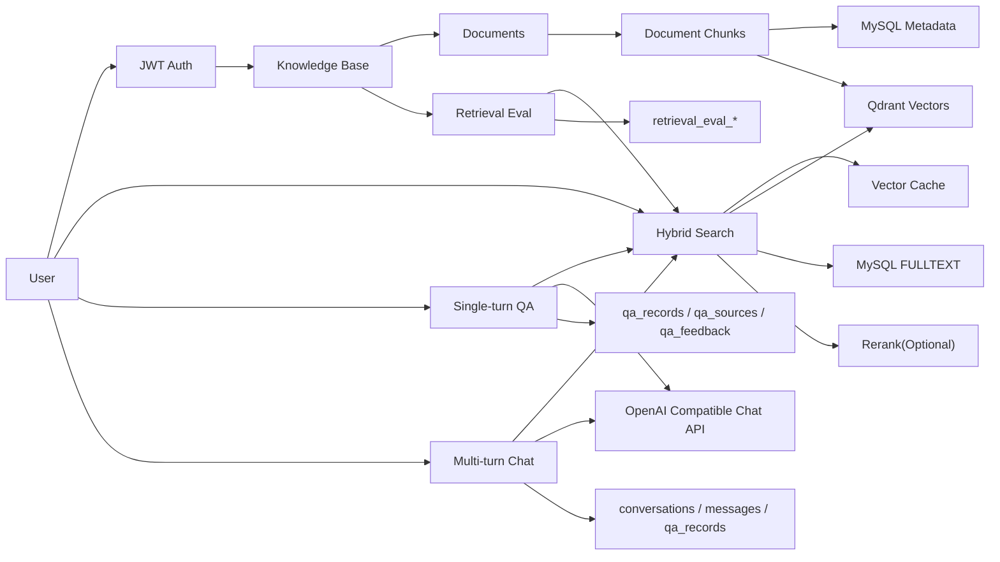
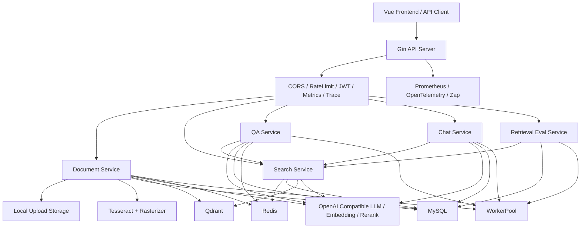
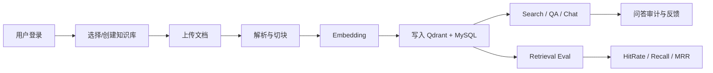
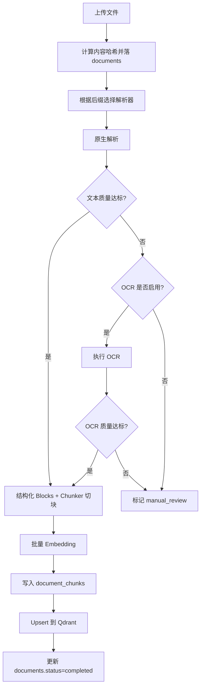
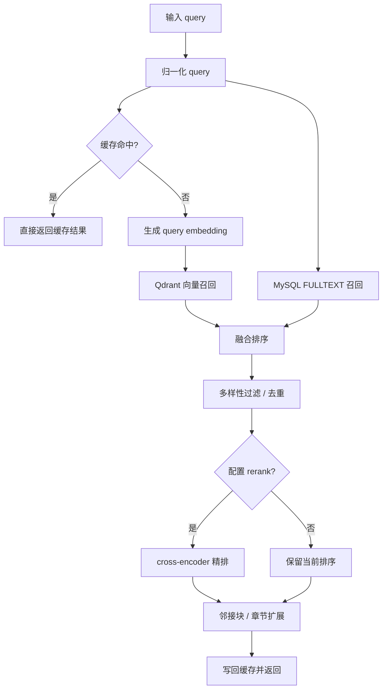
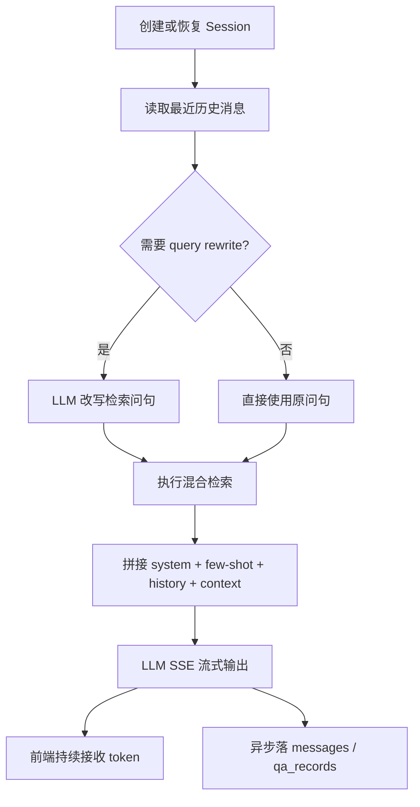

# RAG_ROBOT

> 项目介绍：本项目是一套由 Go 开发的企业知识库 RAG 智能问答系统，围绕“知识库隔离、文档入库、混合检索、单轮问答、多轮对话、检索评测、缓存与可观测性”展开设计，目标是为企业内部制度、流程、技术文档提供稳定、可追溯、可评测的智能检索与问答能力。

# 技术栈

| 维度 | 组件/工具 | 说明 |
| --- | --- | --- |
| 开发语言 | Go 1.25+ | 后端核心业务逻辑实现，承载 API、文档处理、检索、QA、Chat、评测。 |
| Web 框架 | Gin | HTTP 路由注册、中间件、参数绑定、统一响应。 |
| 鉴权 | JWT + bcrypt | 支持注册、登录、Bearer Token 鉴权与用户上下文注入。 |
| 关系型数据库 | MySQL 8 | 存储用户、知识库、文档、切片、会话、问答审计、检索评测等业务元数据。 |
| 向量数据库 | Qdrant | 存储 `document_chunks` 对应向量点，支持按 `knowledge_base_id` 过滤检索。 |
| 大模型接入 | OpenAI 兼容接口 / DashScope | 默认通过兼容接口调用对话模型与 Embedding 模型；支持 `qwen-plus`、`text-embedding-v3` 等配置化切换。 |
| 重排 | Rerank Client（可选） | 在向量召回与全文召回融合后，对候选片段进行 cross-encoder 精排。 |
| 缓存 | Local TTL Cache + Redis | 支持向量检索缓存、QA 结果缓存、按知识库反向索引精确失效。 |
| 文档解析 | TXT / Markdown / PDF / DOCX Parser | 支持多格式解析，PDF 具备原生抽取、OCR 兜底、人工校验转人工的分层策略。 |
| OCR | Tesseract + pdftoppm / mutool / magick | 用于扫描版 PDF 的图像 OCR 识别。 |
| 检索策略 | Qdrant + MySQL FULLTEXT | 向量召回和词法召回双路并发，支持融合排序、邻接扩展、章节扩展与降级检索。 |
| 可观测性 | Prometheus + OpenTelemetry + Zap | 暴露指标、链路追踪、结构化日志、依赖健康检查。 |
| 稳定性 | Circuit Breaker + WorkerPool | 针对 OpenAI/Qdrant 做熔断保护，异步持久化与后台任务通过协程池削峰。 |
| 前端 | Vue 3 + Vite | 提供基础问答前端页面，作为 API 消费端。 |
| 部署辅助 | Dockerfile / Nginx Perf Config | 仓库内包含压测与部署相关容器配置、Nginx 配置、Qdrant 本地存储目录。 |

## 模块设计

### 用户与鉴权系统

#### 表设计

| 表 | 关键字段 | 作用 |
| --- | --- | --- |
| `organizations` | `org_code`, `name`, `status` | 组织/租户基础信息，当前默认存在 `id=1` 的默认组织。 |
| `users` | `org_id`, `username`, `display_name`, `password_hash`, `role` | 用户账号、身份信息和登录凭证。 |
| `user_knowledge_bases` | `user_id`, `knowledge_base_id`, `role`, `granted_by` | 用户与知识库授权关系，承载知识库级别的访问控制。 |

#### 相关方法

| 层级 | 方法/路由 | 输入 -> 输出 | 存储 | 核心说明 |
| --- | --- | --- | --- | --- |
| Handler | `POST /api/v1/auth/register` | `{username,password,display_name,email}` -> `{id,username,display_name}` | MySQL | 注册用户，密码使用 bcrypt 哈希存储。 |
| Handler | `POST /api/v1/auth/login` | `{username,password}` -> `{token,expires_at,user}` | MySQL | 登录成功签发 JWT，后续受保护接口统一读取 Bearer Token。 |
| Handler | `GET /api/v1/auth/profile` | `Authorization` -> `user` | MySQL | 读取当前登录用户信息。 |
| Middleware | `JWTAuth` | `Authorization` -> `user_id/username/role` | - | 解析 JWT 并将用户上下文写入 Gin Context。 |
| Middleware | `KBOwnership/KBIDsOwnership` | `knowledge_base_id(s)` -> `allow/deny` | MySQL | 对单知识库或多知识库请求做归属校验，防止越权访问。 |

### 知识库系统

#### 表设计

| 表 | 关键字段 | 作用 |
| --- | --- | --- |
| `knowledge_bases` | `org_id`, `name`, `description`, `embedding_model`, `vector_collection`, `status` | 知识库主表，每个知识库对应一组文档和检索权限边界。 |
| `user_knowledge_bases` | `user_id`, `knowledge_base_id`, `role` | 记录知识库属主与授权成员。 |

#### 相关方法

| 层级 | 方法/路由 | 输入 -> 输出 | 存储 | 核心说明 |
| --- | --- | --- | --- | --- |
| Handler | `POST /api/v1/kb` | `{name,description}` -> `kb` | MySQL | 创建知识库，并自动为创建者授予 `owner` 权限。 |
| Handler | `GET /api/v1/kb` | `{}` -> `kb[]` | MySQL | 查询当前用户有权限访问的知识库列表。 |
| Handler | `GET /api/v1/kb/:id` | `:id` -> `kb` | MySQL | 查询单个知识库详情。 |
| Handler | `DELETE /api/v1/kb/:id` | `:id` -> `{}` | MySQL | 逻辑删除知识库，并清理授权映射。 |
| Handler | `POST /api/v1/kb/:id/grant` | `{user_id,role}` -> `{}` | MySQL | 向指定用户授予知识库访问权限。 |

### 文档入库系统

#### 表设计

| 表 | 关键字段 | 作用 |
| --- | --- | --- |
| `documents` | `knowledge_base_id`, `name`, `file_type`, `status`, `chunk_count`, `content_hash` | 文档主记录，追踪上传状态、去重和错误信息。 |
| `document_chunks` | `document_id`, `chunk_index`, `content`, `raw_text`, `heading_path_json`, `qdrant_point_id` | 文档切片表，连接 MySQL 元数据与 Qdrant 向量点。 |
| `ingestion_tasks` | `document_id`, `task_type`, `status`, `retry_count` | 预留的异步入库任务跟踪表。 |

#### 相关方法

| 层级 | 方法/路由 | 输入 -> 输出 | 存储 | 核心说明 |
| --- | --- | --- | --- | --- |
| Handler | `POST /api/v1/document/upload` | `multipart(file, knowledge_base_id)` -> `upload_response` | Local Disk / MySQL / Qdrant | 处理文档完整入库流程：保存文件、去重、解析、切块、向量化、入库。 |
| Handler | `DELETE /api/v1/document/:id` | `:id` -> `{}` | MySQL / Qdrant / Local Disk | 文档删除先受理再异步执行，过程中会清理缓存并删除向量点。 |
| Service | `ProcessDocument` | `file` -> `Document + Chunk + Vector` | Local Disk / MySQL / Qdrant | 支持 `txt/md/pdf/docx`，PDF 走 native -> OCR -> manual_review 分级策略。 |
| Service | `DeleteDocument` | `doc_id` -> `accepted` | MySQL / Qdrant / Cache | 将状态置为 `deleting` 后，后台协程池异步删除向量、文件和数据库记录。 |

#### 入库子流程

1. 上传文件到 `uploads/yyyy/MM/dd/` 目录，并计算 MD5 用于同知识库内去重。
2. 在 `documents` 表创建主记录；命中重复上传时复用已有记录。
3. 根据文件类型选择解析器。
4. PDF 优先原生抽取；文本质量不足时尝试 OCR；仍不达标则标记为 `manual_review`。
5. 将解析结果转换为 `Block`，再按 token 大小、章节路径和结构类型切块。
6. 调用 Embedding 接口批量生成向量。
7. 先写 `document_chunks`，再批量 Upsert 到 Qdrant。
8. 更新文档状态为 `completed` 并记录 `chunk_count`。

### 检索系统

#### 表设计

| 表 | 关键字段 | 作用 |
| --- | --- | --- |
| `document_chunks` | `content`, `section_title`, `heading_path_json` | MySQL FULLTEXT 召回、章节扩展、邻接扩展的核心数据来源。 |
| Qdrant `rag_chunks` | `knowledge_base_id`, `document_id`, `chunk_index`, `content`, `heading_path` | 向量召回主索引。 |

#### 相关方法

| 层级 | 方法/路由 | 输入 -> 输出 | 存储 | 核心说明 |
| --- | --- | --- | --- | --- |
| Handler | `POST /api/v1/search` | `{query,knowledge_base_ids?,top_k}` -> `hits[]` | Redis / Qdrant / MySQL | 对单库、多库或“当前用户全部授权知识库”做混合检索。 |
| Service | `Search` | `query` -> `SearchResult[]` | Local Cache / Redis / Qdrant / MySQL | 支持 query 归一化、缓存、混合召回、rerank、相邻块扩展。 |
| Service | `SearchForEvaluation` | `query,kb_id` -> `anchor_hits + trace` | Qdrant / MySQL | 评测模式禁缓存、不扩邻接块，保留更纯净的检索轨迹。 |

#### 检索链路设计

1. 对 query 做轻量归一化，统一缓存 key 与召回输入。
2. 先查 Local TTL + Redis 向量检索缓存。
3. 并发执行两路召回：
   - Qdrant 向量检索
   - MySQL FULLTEXT 检索
4. 过滤掉状态不是 `completed` 的文档，避免脏数据返回。
5. 融合向量分、词法分、双命中 bonus、轻量 lexical boost。
6. 通过文档多样性、内容去重、相邻 chunk 压制控制结果质量。
7. 若配置了 rerank 模型，则对候选池做 cross-encoder 精排。
8. 在线检索场景补充邻接 chunk 或整章节上下文，提升后续 LLM 回答质量。
9. 若向量检索不可用，则退化为 FULLTEXT 结果，并通过 `is_fallback` 标记告知上层。

### 单轮 QA 系统

#### 表设计

| 表 | 关键字段 | 作用 |
| --- | --- | --- |
| `qa_records` | `knowledge_base_id`, `question_text`, `answer_text`, `answer_model`, `status`, `top_score` | 单轮问答审计主表。 |
| `qa_sources` | `qa_record_id`, `document_id`, `chunk_id`, `rank_no`, `score` | 记录回答使用的来源片段。 |
| `qa_feedback` | `qa_record_id`, `rating`, `comment` | 用户对回答的满意度反馈。 |

#### 相关方法

| 层级 | 方法/路由 | 输入 -> 输出 | 存储 | 核心说明 |
| --- | --- | --- | --- | --- |
| Handler | `POST /api/v1/qa` | `{question,knowledge_base_ids?,top_k}` -> `{qa_record_id,answer,sources,is_fallback}` | Redis / Qdrant / MySQL / LLM | 单轮 RAG 问答，支持多知识库范围。 |
| Handler | `POST /api/v1/qa/feedback` | `{qa_record_id,rating,comment}` -> `{}` | MySQL | 收集问答反馈。 |
| Service | `AskQuestion` | `question` -> `answer` | Local Cache / Redis / MySQL / LLM | 先查 QA 缓存，未命中再执行检索与生成。 |
| Service | `Ask` | `question` -> `answer + sources` | Qdrant / MySQL / LLM | 构造 RAG 上下文、Few-shot Prompt，调用 LLM 生成回答。 |

#### QA 设计要点

- 当检索无命中时，直接返回“未找到相关内容”，不额外消耗 LLM。
- 当 OpenAI 兼容接口异常时，降级为“直接返回原文片段摘要”，保证服务可用。
- `qa_records` 同步或异步落库，用于审计、统计与后续评测样本构建。
- `qa_sources` 保存 topK 来源，便于前端展示答案出处与可解释性。

### 多轮 Chat 系统

#### 表设计

| 表 | 关键字段 | 作用 |
| --- | --- | --- |
| `conversations` | `user_id`, `knowledge_base_id`, `session_id`, `status`, `last_question_at` | 会话主表，支持单库或跨库会话。 |
| `messages` | `conversation_id`, `role`, `content`, `token_count` | 多轮消息历史。 |
| `qa_records` | `conversation_id`, `question_text`, `answer_text`, `status` | 每轮对话也会记入问答审计链路。 |

#### 相关方法

| 层级 | 方法/路由 | 输入 -> 输出 | 存储 | 核心说明 |
| --- | --- | --- | --- | --- |
| Handler | `POST /api/v1/chat/session` | `{knowledge_base_ids?}` -> `{session_id}` | MySQL / Memory | 创建新会话；支持单库、指定多库或当前用户全集。 |
| Handler | `POST /api/v1/chat` | `{session_id,message}` -> `SSE stream` | MySQL / Qdrant / LLM | 多轮流式对话，返回 SSE token 流。 |
| Service | `CreateSession` | `user_id,kb_ids` -> `session_id` | Memory / MySQL | 先写内存会话，数据库持久化异步执行，优化会话创建 RT。 |
| Service | `Chat` | `session_id,message` -> `stream` | Memory / MySQL / Qdrant / LLM | 会话恢复、查询改写、检索、拼 Prompt、流式输出、异步落库。 |

#### Chat 设计要点

- 会话创建采用“内存优先、数据库异步回填”策略，降低高并发场景下的首包延迟。
- 支持 query rewrite：针对“它怎么配置”“那下一步呢”这类跟进问句，先改写为独立检索问句。
- SSE 流式返回 token，完成后再异步持久化 `messages` 与 `qa_records`。
- 支持输出首 token 细分耗时，用于压测和性能优化。

### 检索评测系统

#### 表设计

| 表 | 关键字段 | 作用 |
| --- | --- | --- |
| `retrieval_eval_datasets` | `knowledge_base_id`, `name`, `status` | 检索评测数据集。 |
| `retrieval_eval_cases` | `dataset_id`, `query_text`, `label_status`, `source_type` | 评测案例集。 |
| `retrieval_eval_labels` | `case_id`, `document_id`, `chunk_id`, `relevance_grade` | 案例标准答案标注。 |
| `retrieval_eval_runs` | `dataset_id`, `max_k`, `hit_rate_at_*`, `recall_at_*`, `mrr_at_10` | 评测运行汇总。 |
| `retrieval_eval_run_cases` | `run_id`, `case_id`, `first_relevant_rank`, `recall_at_*` | 单案例评测结果。 |
| `retrieval_eval_run_hits` | `run_case_id`, `rank_no`, `chunk_id`, `score`, `retrieval_source` | 每次运行的命中明细。 |

#### 相关方法

| 层级 | 方法/路由 | 输入 -> 输出 | 存储 | 核心说明 |
| --- | --- | --- | --- | --- |
| Handler | `POST /api/v1/retrieval-eval/datasets` | `{knowledge_base_id,name,description}` -> `{id}` | MySQL | 创建评测数据集。 |
| Handler | `POST /api/v1/retrieval-eval/datasets/:id/cases` | `{cases[]}` -> `{}` | MySQL | 批量添加评测 query。 |
| Handler | `POST /api/v1/retrieval-eval/cases/:id/labels` | `{labels[]}` -> `{}` | MySQL | 覆盖更新标准标签。 |
| Handler | `POST /api/v1/retrieval-eval/runs` | `{dataset_id,max_k}` -> `{run_id,status}` | MySQL / WorkerPool | 启动一次异步评测运行。 |
| Handler | `GET /api/v1/retrieval-eval/runs/:id` | `:id` -> `run_detail` | MySQL | 查看评测汇总和案例结果。 |
| Handler | `GET /api/v1/retrieval-eval/runs/:id/cases` | `:id` -> `run_cases[]` | MySQL | 查看逐条案例表现。 |
| Handler | `POST /api/v1/retrieval-eval/preview` | `{query,knowledge_base_id,top_k}` -> `hits[]` | Qdrant / MySQL | 在线预览评测模式下的检索结果。 |

## 各个模块的关系



## 缓存优化部分

| 缓存层 | Key 模式 | Value 内容 | TTL | 设计说明 |
| --- | --- | --- | --- | --- |
| 本地向量缓存 | `vector:v6:{kbIDsHash}:{queryHash}:{topK}` | `SearchHit[]` | 默认 120s | 进程内一级缓存，降低重复 query 的网络往返。 |
| Redis 向量缓存 | `vector:v6:*` + `vector:kbidx:v6:{kbID}` | `SearchHit[]` | 默认 30m | 支持 exact key 与 canonical key，按知识库维护反向索引精确失效。 |
| 本地 QA 缓存 | `qa:v3:{kbIDsHash}:{questionHash}` | `QAResult` | 默认 300s | 缓存单轮问答结果，减少重复问答时的 LLM 调用。 |
| Redis QA 缓存 | `qa:v3:*` + `qa:kbidx:v3:{kbID}` | `QAResult` | 默认 1h | 按知识库反向索引批量失效，保证文档变更后缓存及时淘汰。 |

## 可靠性与性能优化部分

| 维度 | 设计点 | 实现方式 | 价值 |
| --- | --- | --- | --- |
| 检索降级 | Qdrant 不可用时退化到 FULLTEXT | `Search` 双路召回，任一路成功即可继续 | 提高核心检索链路可用性。 |
| 生成降级 | LLM 不可用时返回原文片段 | QA 层构造 fallback answer | 避免“检索成功但无响应”。 |
| 熔断 | OpenAI / Qdrant 熔断器 | 可配置窗口、失败率、重置时间 | 防止外部依赖抖动拖垮整个服务。 |
| 异步化 | 协程池异步写库与删除任务 | `WorkerPool` 承担会话持久化、文档删除、评测任务等 | 缩短请求耗时，提升吞吐。 |
| OCR 分层 | native -> OCR -> manual_review | PDF 质量评估后自动切换策略 | 避免脏文本直接进入知识库。 |
| 检索质量 | 向量 + FULLTEXT + rerank | 双路融合、章节扩展、邻接扩展、可选精排 | 提升召回率与回答上下文完整性。 |
| 可观测性 | Metrics + Tracing + Health | `/metrics`、`/health`、OpenTelemetry | 便于线上监控、压测与故障定位。 |
| 权限隔离 | 知识库级授权 | `user_knowledge_bases` + ownership middleware | 支持多用户共享服务且避免越权。 |

# 整体架构



# 流程图

## 整体流程图



## 核心子流程图

### 子流程 A：文档上传 / OCR / 入库



### 子流程 B：混合检索 / 精排 / 上下文扩展



### 子流程 C：Chat 流式问答



# 亮点解析

| 维度 | 亮点名称 | 技术实现与设计细节 | 业务价值与优势 |
| --- | --- | --- | --- |
| 架构设计 | 知识库级权限隔离 | 通过 `user_knowledge_bases` + ownership middleware，对单库和多库请求统一做归属校验。 | 支持多用户共享服务，避免跨知识库越权读写。 |
| 文档处理 | PDF 分层解析策略 | 原生抽取先行，质量不足自动切 OCR，OCR 仍不达标转 `manual_review`。 | 减少扫描版 PDF 造成的脏数据入库问题。 |
| 切块设计 | 结构感知切块 | `Block -> Chunk` 保留 `heading_path / page / chunk_type / source_kind` 等结构元数据。 | 后续检索、引用来源、章节扩展和问答解释性更强。 |
| 检索策略 | 向量 + FULLTEXT 混合召回 | 两路并发召回后融合排序，并支持 rerank、去重、多样性约束。 | 同时兼顾语义相关性和关键词精确命中。 |
| 检索质量 | 章节扩展与邻接扩展 | 命中锚点后补充同章节或前后相邻 chunk。 | 给 LLM 更完整上下文，减少答非所问和断章取义。 |
| 缓存设计 | 按知识库反向索引失效 | Vector/QA 缓存写入时额外维护 `kbidx` 索引，文档变更时按 KB 精确清理。 | 避免全量扫 Key，兼顾缓存命中率与一致性。 |
| 可用性 | 多级降级链路 | Qdrant 失败退 FULLTEXT，LLM 失败退原文摘要，Redis 失败退直查。 | 在依赖抖动时仍能输出可用结果。 |
| 性能优化 | 会话与持久化异步化 | `CreateSession` 优先返回，消息与 QA 审计通过协程池异步落库。 | 降低高并发场景下首包延迟和接口 RT。 |
| 模型成本 | 稳定 Prompt 前缀 | QA/Chat 共享固定 system prompt 与 few-shot，兼顾效果与兼容式前缀缓存。 | 有利于降低大模型调用成本并稳定回答风格。 |
| 评测闭环 | 内置检索评测体系 | 支持 dataset/case/label/run 全链路，并输出 HitRate@K、Recall@K、MRR@10。 | 让检索优化从“感觉好一点”变成“指标可验证”。 |
| 可运维性 | 指标与链路追踪齐备 | Prometheus 指标、健康检查、OpenTelemetry tracing、结构化日志。 | 便于压测、观测、排障和容量规划。 |

# 项目目录设计

```text
RAG_ROBOT/
├── cmd/
│   ├── server/                # 主服务入口
│   ├── eval-baseline/         # 评测/压测辅助入口（当前仓库中已出现）
│   └── reindex/               # 向量维度变化后的重建入口
├── internal/
│   ├── api/
│   │   ├── handler/           # HTTP Handler
│   │   ├── middleware/        # JWT、限流、指标、追踪、知识库归属校验
│   │   └── router/            # 路由装配
│   ├── model/                 # 领域模型
│   ├── pkg/                   # 配置、日志、熔断、限流、OpenAI、Parser、Tracing 等工具模块
│   ├── repository/
│   │   ├── cache/             # Redis + Local TTL 缓存
│   │   ├── database/          # MySQL 仓储
│   │   └── qdrant/            # Qdrant 客户端封装
│   └── service/
│       ├── document/          # 文档处理
│       ├── search/            # 混合检索
│       ├── qa/                # 单轮问答
│       ├── chat/              # 多轮会话
│       └── retrievaleval/     # 检索评测
├── configs/                   # 配置模板
├── deployments/               # Docker / Nginx / Qdrant 本地存储
├── docs/                      # 设计与压测文档
├── frontend/                  # Vue 3 前端
├── scripts/                   # 初始化与迁移脚本
├── uploads/                   # 上传后的文档文件
├── go.mod
└── RAG_ROBOT项目设计.md
```

# 总结

`RAG_ROBOT` 当前已经不仅是一个“上传文档然后调用 LLM”的 Demo，而是一套具备企业知识库边界、文档结构化入库、混合检索、生成降级、会话能力、评测闭环和可观测性的 RAG 服务骨架。后续若继续演进，最自然的方向包括：

1. 完善多组织隔离与用户体系，把默认组织升级为真正的 SaaS 多租户模型。
2. 补齐文档异步任务编排、重试队列与后台管理页面。
3. 强化检索评测样本构建与自动化回归，形成“改召回即跑评测”的工程闭环。
4. 基于当前知识库、问答记录和反馈数据，进一步做个性化检索和答案质量优化。
